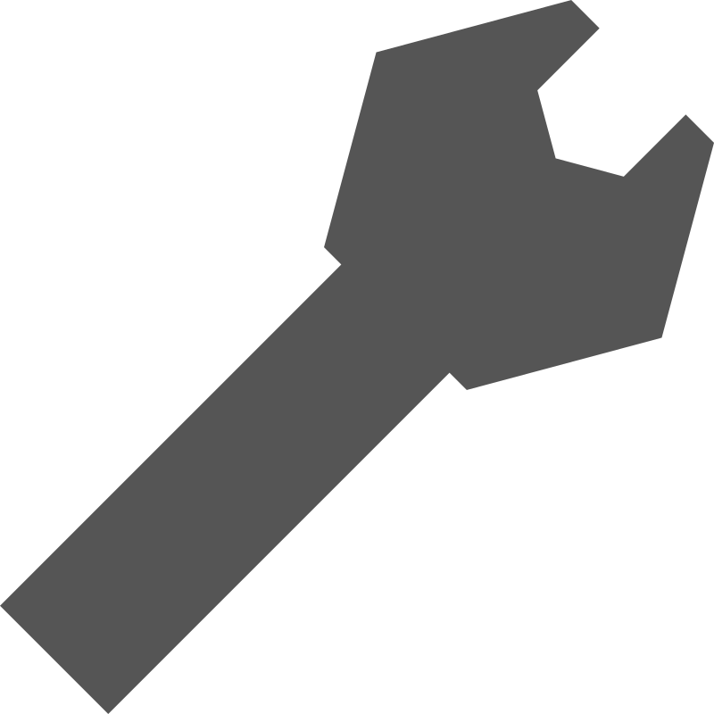

# worker - organising executables like games for linux

---
<center>

<span style="font-size: 20px;font-weight: bolder;">WORKER</span>
</center>

### PHP-CLI app for organising executables like games for linux

#### Usage:

```text 
Usage: worker [OPTION]... [SUB-OPTION]... 

option:
	install - Install App from Given [DIRECTORY-PATH]
	uninstall - Completely Remove App and It's Files
	init - Initialise Current Directory for worker
	help - Show This Message

sub-option:
	install:
	Use Case: install [PATH] [APP]
	  [PATH] - Give path for Directory containing appfiles
	  [APP] - Appname for symlink
```

### Requirement:

- PHP (Version: >8.4)
- GNU make (Version: >4.0)

### Installation Steps:

1. Run the below code:

```bash
make clean local
```

> or to install for every user

```bash
sudo make clean global
```
> or
```bash
doas make clean global
```
